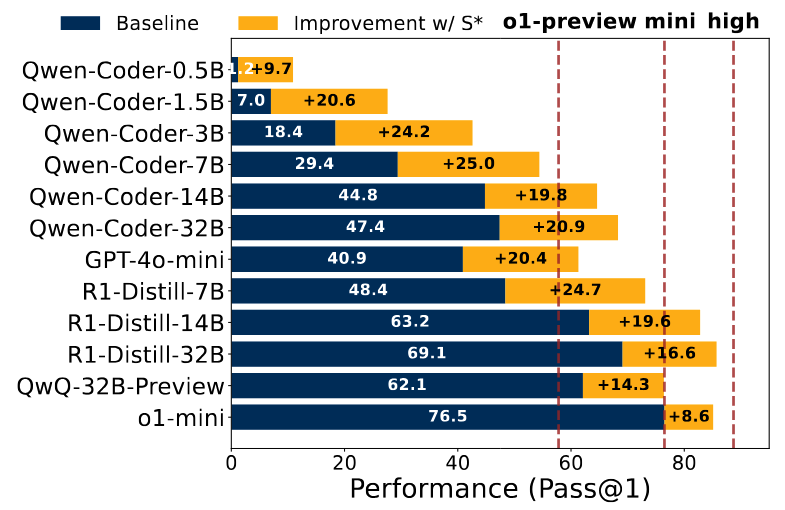

# S*: Test Time Scaling for Code Generation ####
This folder provides the code for the paper "S*: Test Time Scaling for Code Generation".



## Installation (Main packages)
```dspy=2.6.2, torch, vllm```

## Usage
The scripts to reproduce the results in the paper are in the `scripts` folder.
- baselines are in `baselines`, `baselines_selfdebug`, `majority_baselines`.
- experiments on dev set are in: `sec[4,5,6]`.
- experiments on final test set are in: `final_[]`. First run commands under `final_oracle` to produce all generations without different selection methods, then run commands under `final_[]_cached` to produce generations with different selection methods.

Results are availeble in google cloud storage ([Link](https://drive.google.com/drive/u/1/folders/1kmCoJ7Mkvj-umpkfsA5960hYpNrgH4X4)).

Simple run commands to produce generations with oracle selection and 3 rounds of generation for gpt-4o-mini.

Set OPENAI_API_KEY in your environment variable with `export OPENAI_API_KEY=xxx`.

```
python evaluate_multiprocess.py \
    --difficulty=easy \
    --temperature=0.7 \
    --num_threads=32 \
    --n=16 \
    --selection oracle_all_rounds \
    --lcb_version release_v2 \
    --num_round 3 \
    --result_json_path="results/final_4omini_n_16_debug_public3_select_oracle_easy.json"
```

To run experiments with local serve models, use ```vllm serve model_name``` to serve the model first.


#### Citation
```
@article{li2025sstar,
  title={S*: Test Time Scaling for Code Generation},
  author={Li, Dacheng and Cao, Shiyi and Cao, Chengkun and Li, Xiuyu and Tan, Shangyin and Keutzer, Kurt and Xing, Jiarong and Gonzalez, Joseph E. and Stoica, Ion},
  year={2025}
}
```


